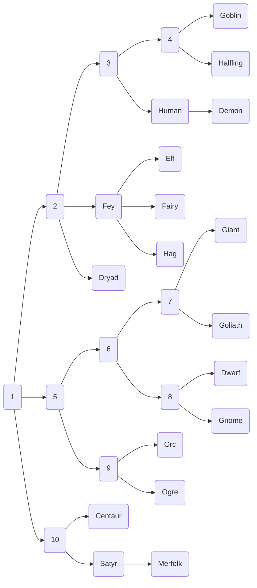

A humanoid race is any race that falls on the **humanoid evolutionary tree**.
# Humanoid Evolutionary Tree

#  List of Races in the Humanoid Tree

| **Race**     | **Average lifespan (solar years)** | **Distinguishing features**                                                                 |
| ------------ | ---------------------------------- | ------------------------------------------------------------------------------------------- |
| [[Goblin]]   | 60                                 | Short stature, green skin, large ears                                                       |
| [[Halfling]] | 100                                | Short stature, apparent eternal youth                                                       |
| [[Human]]    | 90                                 | Distinguishably featureless                                                                 |
| [[Demon]]    | 90                                 | Wings, horns, tail and various other "infernal" traits                                      |
| [[Fey]]      | 250                                | Affinity with magic, left-handedness more common, sixth finger common                       |
| [[Elf]]      | 400                                | Slender body, long ears                                                                     |
| [[Fairy]]    | 300                                | Very small size, winged and bug-like feature                                                |
| [[Hag]]      | 300                                |                                                                                             |
| [[Dryad]]    | 150 (possibly near infinite)       | Plant-like anatomy                                                                          |
| [[Giant]]    | 500                                | Extreme stature, features that are now vestigial in other races are still useful for giants |
| [[Goliath]]  | 200                                | Tall stature, stone-like skin and flesh                                                     |
| [[Dwarf]]    | 250                                | Short and stocky, particularly hairy                                                        |
| [[Gnome]]    | 250                                |                                                                                             |
| [[Orc]]      | 70                                 | Tall stature and muscular structure, green skin, tusks                                      |
| [[Ogre]]     | 70                                 |                                                                                             |
| [[Centaur]]  |                                    | Quadrupedal animal bottom half                                                              |
| [[Merfolk]]  | 150                                | Fish bottom half, they're technically satyrs                                                |
| [[Satyr]]    |                                    | Bipedal animal bottom half                                                                  |

